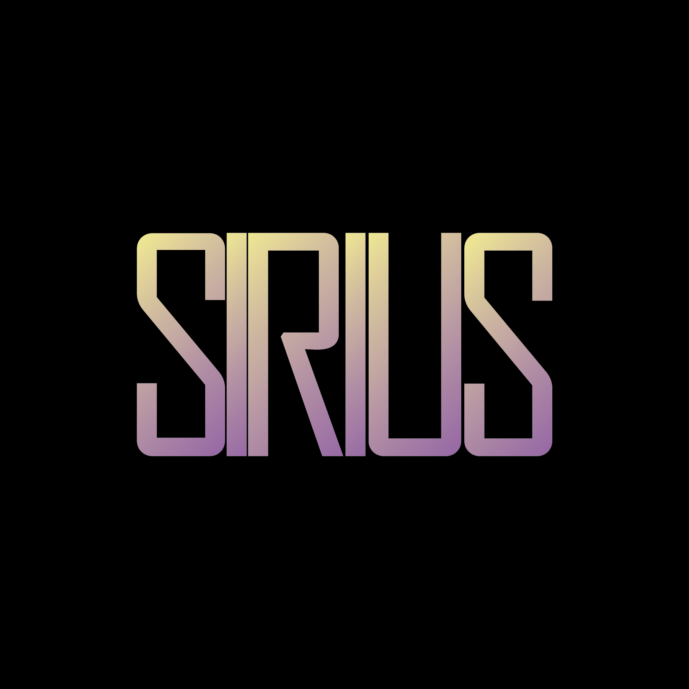

# Sirius.NET 🌟

## About Us

At Sirius.NET, we are a cutting-edge IT services company dedicated to transforming businesses through innovative digital solutions. Our mission is to help clients not just compete, but lead in their industries.

## Our Core Approach: Design, Development, Deployment

### 🎨 Design
- Collaborative approach to understanding business needs
- Comprehensive design roadmaps
- User-centric design solutions

### 💻 Development
- Agile methodologies
- Scalable solutions across multiple platforms
- Expertise in web, mobile, AI, blockchain, and more

### 🚀 Deployment
- Seamless transition from development to production
- Robust security and monitoring
- Continuous support and optimization

## Technologies We Use

### Frontend
- React.js
- Vue.js
- Angular.js
- Next.js
- HTML5 & CSS3

### Backend
- PHP
- Python
- Java
- Laravel
- Docker

## Services

- Web & App Development
- AI Solutions
- Blockchain Development
- Cloud & Cybersecurity
- Game Development
- Data Science & Machine Learning

## Connect With Us

- Website: [https://sirius-net-co.framer.website](https://sirius-net-co.framer.website)
- Email: [sirius.net.co@gmail.com](mailto:sirius.net.co@gmail.com)
- LinkedIn: [Sirius.NET Company Page](https://www.linkedin.com/company/sirius-net-co)

*Powering digital transformation for global enterprises*
